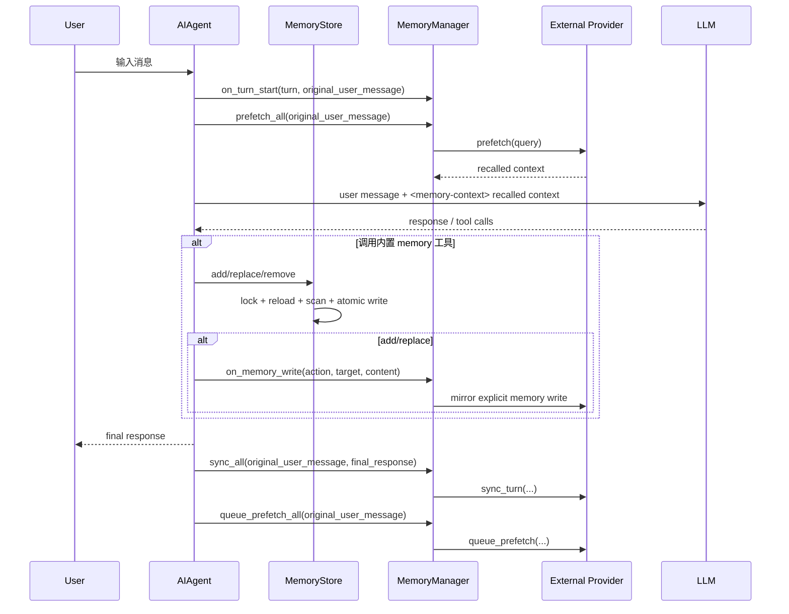

# Hermes 记忆存储机制分析

> 代码阅读范围：`tools/memory_tool.py`、`agent/agent_init.py`、`agent/system_prompt.py`、`agent/turn_context.py`、`agent/conversation_loop.py`、`agent/memory_provider.py`、`agent/memory_manager.py`、`plugins/memory/*`、`hermes_cli/memory_setup.py`、`hermes_cli/main.py`。

## 1. 总体结论

Hermes 的记忆系统分成两层：

1. **内置文件记忆**：始终作为基础能力存在，核心存储是 `$HERMES_HOME/memories/MEMORY.md` 和 `$HERMES_HOME/memories/USER.md`。
2. **外部 memory provider**：通过 `config.yaml` 的 `memory.provider` 激活，一次只能启用一个外部 provider，例如 `honcho`、`hindsight`、`mem0`、`holographic`、`supermemory` 等。

两层不是互斥关系。内置记忆负责小而稳定的事实快照，外部 provider 负责更强的语义检索、用户建模、知识图谱、会话总结或云端/本地长期存储。

## 2. 配置入口

默认配置在 `hermes_cli/config.py` 的 `DEFAULT_CONFIG["memory"]`：

```yaml
memory:
  memory_enabled: true
  user_profile_enabled: true
  memory_char_limit: 2200
  user_char_limit: 1375
  nudge_interval: 10
  provider: ""
```

含义：

- `memory_enabled`：是否启用 `MEMORY.md` 注入。
- `user_profile_enabled`：是否启用 `USER.md` 注入。
- `memory_char_limit` / `user_char_limit`：内置文件记忆的字符预算，不是 token 预算。
- `nudge_interval`：周期性提醒模型考虑是否要保存长期记忆。
- `provider`：外部 provider 名称。空字符串表示只使用内置记忆。

CLI 入口：

- `hermes memory setup`：选择并配置外部 provider。
- `hermes memory setup <provider>`：直接配置指定 provider。
- `hermes memory status`：查看当前 provider 状态。
- `hermes memory off`：关闭外部 provider，回到 built-in only。
- `hermes memory reset --target all|memory|user`：删除内置 `MEMORY.md` / `USER.md` 文件。

## 3. 内置文件记忆：MEMORY.md / USER.md

实现文件：`tools/memory_tool.py`。

内置记忆有两个目标：

- `target="memory"`：写入 `MEMORY.md`，用于 agent 自己的稳定笔记，比如项目约定、环境事实、工具坑点。
- `target="user"`：写入 `USER.md`，用于用户画像，比如用户偏好、沟通风格、工作习惯。

存储目录通过 `get_hermes_home() / "memories"` 动态解析，因此支持 Hermes profile 隔离。不要把它理解成固定的 `~/.hermes/memories`，因为 profile 模式会改变 `HERMES_HOME`。

### 3.1 数据格式

两个文件都被当作“条目列表”处理。条目之间用 `ENTRY_DELIMITER = "\n§\n"` 分隔。

读入逻辑：

1. 读取文件内容。
2. 按 delimiter 切成条目。
3. 去空白。
4. 去重，保留第一次出现的条目。

写入逻辑：

1. 将条目列表重新用 delimiter join。
2. 写入同目录临时文件。
3. `fsync` 后通过 `atomic_replace` 原子替换目标文件。

这保证读者只能看到旧完整文件或新完整文件，不会看到写到一半的空文件。

### 3.2 MemoryStore 的双状态模型

`MemoryStore` 同时维护两份状态：

- `memory_entries` / `user_entries`：当前进程里的 live state，工具调用后会更新。
- `_system_prompt_snapshot`：启动时从磁盘加载并冻结的快照，用于 system prompt 注入。

这个设计很关键：**本轮会话中写入 memory 会立即落盘，但不会改变当前 system prompt**。这样做是为了保持 prompt prefix cache 稳定。新的记忆要到下一次 session start，或者 context compression 触发 system prompt rebuild 后才会进入 prompt。

`agent/system_prompt.py` 里通过：

```python
agent._memory_store.format_for_system_prompt("memory")
agent._memory_store.format_for_system_prompt("user")
```

把冻结快照放进 volatile prompt tier。

### 3.3 工具接口

内置工具 schema 名称是 `memory`，动作包括：

- `add`：追加条目。
- `replace`：用 `old_text` 的唯一子串匹配替换条目。
- `remove`：用 `old_text` 的唯一子串匹配删除条目。

没有 `read` 动作，虽然部分注释里还提到 read。这说明注释和当前 schema 有一点历史残留；实际 schema enum 只有 `add | replace | remove`。

工具执行在 `agent/tool_executor.py` 特判：

```python
elif function_name == "memory":
    from tools.memory_tool import memory_tool
    result = memory_tool(..., store=agent._memory_store)
```

它不是普通 registry 工具的完全通用路径，而是 agent-level tool，由运行时传入当前 agent 的 `MemoryStore`。

### 3.4 安全与一致性保护

内置记忆做了几层保护：

1. **写入前扫描**：`add` / `replace` 会调用 threat pattern 扫描，阻止 prompt injection / exfiltration 风险内容进入长期记忆。
2. **加载时快照净化**：磁盘里已有的可疑条目不会进入 system prompt，而是以 `[BLOCKED: ...]` 占位符进入快照；live state 保留原文，方便用户删除。
3. **文件锁**：用 `.lock` 文件加排他锁，Unix 用 `fcntl`，Windows 用 `msvcrt`。
4. **漂移检测**：写入前重新读取磁盘。如果发现文件不能 round-trip，或单条条目超过整个 store 的 char limit，会先备份 `.bak.<ts>`，然后拒绝写入，避免覆盖手工编辑、patch 工具或另一个 session 追加的内容。
5. **字符预算**：超过 `memory_char_limit` / `user_char_limit` 时拒绝新增或替换，并返回当前 entries，要求先合并或删除。

## 4. Agent 初始化与 system prompt 注入

初始化在 `agent/agent_init.py`。

流程：

1. 加载 `config.yaml`。
2. 如果 `skip_memory=False`，读取 `memory` 配置。
3. 如果 `memory_enabled` 或 `user_profile_enabled` 为真：
   - 创建 `MemoryStore(memory_char_limit, user_char_limit)`。
   - 调用 `load_from_disk()`。
4. 如果 `memory.provider` 非空：
   - 创建 `MemoryManager`。
   - `plugins.memory.load_memory_provider(name)` 加载 provider。
   - `is_available()` 通过后注册到 manager。
   - `initialize_all(...)` 注入 `session_id`、`platform`、`hermes_home`、gateway user/chat/thread 信息、profile identity 等上下文。
5. 如果外部 provider 暴露工具 schema，并且当前 toolset 允许 `memory`，把这些 schema 注入 agent tool surface。

System prompt 组装在 `agent/system_prompt.py`，分三层：

- stable：身份、工具指导、技能索引等。
- context：用户传入 system message、AGENTS.md / HERMES.md / SOUL.md 等上下文。
- volatile：内置 memory 快照、外部 provider 的静态 prompt block、日期/session/model/provider 信息。

注意：内置 memory 快照虽然叫 volatile tier，但在一个 agent 实例生命周期内仍然被缓存，不会每轮自动刷新。

## 5. 外部 MemoryProvider 抽象

接口定义在 `agent/memory_provider.py`。核心方法：

- `is_available()`：只做轻量配置/依赖检查，不应发网络请求。
- `initialize(session_id, **kwargs)`：初始化连接、资源、后台线程等。
- `system_prompt_block()`：返回静态 provider 说明，放入 system prompt。
- `prefetch(query, session_id="")`：返回当前 turn 要注入的 recalled context。
- `queue_prefetch(query, session_id="")`：在 turn 结束后为下一轮预热。
- `sync_turn(user_content, assistant_content, session_id="", messages=None)`：完成一轮后写入 provider。
- `get_tool_schemas()`：暴露 provider 自己的工具。
- `handle_tool_call(tool_name, args, **kwargs)`：处理 provider 工具调用。
- `shutdown()`：flush 队列、关闭连接。

可选 hook：

- `on_turn_start(...)`：每轮开始，常用于 cadence 计数。
- `on_session_end(messages)`：session 结束时做总结/抽取。
- `on_session_switch(...)`：`/resume`、`/branch`、`/reset`、context compression 等导致 session id 改变时刷新 provider 内部状态。
- `on_pre_compress(messages)`：压缩前提取 provider 关心的信息。
- `on_memory_write(action, target, content, metadata)`：内置 `memory` 工具写入时镜像给外部 provider。
- `on_delegation(task, result, child_session_id, **kwargs)`：父 agent 观察子 agent 结果。

## 6. MemoryManager 编排逻辑

实现文件：`agent/memory_manager.py`。

`MemoryManager` 是外部 provider 的统一入口。当前设计允许：

- built-in provider 名称 `"builtin"` 可以存在。
- 非 built-in 的外部 provider 最多一个。

如果注册第二个外部 provider，会 warning 并拒绝。这是为了避免 tool schema 膨胀、工具名冲突和多后端记忆互相污染。

### 6.1 工具注册与冲突控制

`add_provider()` 会读取 provider 的 `get_tool_schemas()`，建立：

```python
tool_name -> provider
```

它还会拒绝外部 provider 注册 Hermes core tool 同名工具，例如 `clarify`、`delegate_task` 等。core tools 永远优先。

`get_all_tool_schemas()` 再次做去重和 core tool 过滤，保证注入给模型的工具可以被 manager 正确路由。

### 6.2 每轮回忆注入

每轮开始时，`agent/turn_context.py` 做两件事：

1. `agent._memory_manager.on_turn_start(agent._user_turn_count, user_message)`
2. `agent._memory_manager.prefetch_all(user_message)`

`prefetch_all()` 收集所有 provider 的 recalled context。随后在 `agent/conversation_loop.py`，只在 API-call-time 把它追加到当前 user message：

```text
用户原始消息

<memory-context>
[System note: ... recalled memory context, NOT new user input ...]

provider recalled context
</memory-context>
```

这段不会写回 `messages`，因此不会污染 session persistence。它只是本次 API 请求的临时上下文。

### 6.3 memory-context fence

`build_memory_context_block()` 会：

1. 对 provider 输出调用 `sanitize_context()`，去掉 provider 可能返回的 `<memory-context>` 标签或系统 note。
2. 再统一包一层 `<memory-context>`。

此外还有 `StreamingContextScrubber`，用于流式输出时去掉模型可能泄露出来的 memory-context 内容，避免内部 recall context 显示给用户。

### 6.4 每轮同步与下一轮预热

在 `run_agent.py` 的 `_sync_external_memory_for_turn()`：

```python
agent._memory_manager.sync_all(original_user_message, final_response, session_id=..., messages=...)
agent._memory_manager.queue_prefetch_all(original_user_message, session_id=...)
```

特点：

- 只在完整 turn 结束后执行。
- interrupted turn 会跳过，避免把用户没看到的半成品写入长期记忆。
- 用 `original_user_message`，避免把 skill 注入或其他内部上下文写到 provider。
- 外部 provider 失败是 best-effort，不阻塞用户拿到回答。

### 6.5 内置 memory 写入桥接到外部 provider

当模型调用内置 `memory` 工具，并且 action 是 `add` 或 `replace` 时，`agent/tool_executor.py` 会调用：

```python
agent._memory_manager.on_memory_write(action, target, content, metadata=...)
```

这让外部 provider 可以镜像内置 `MEMORY.md` / `USER.md` 的显式写入。`remove` 当前没有在 executor 的桥接条件中触发，虽然 `MemoryManager.on_memory_write()` 本身支持任何 action；这是实现上的一个不对称点。

## 7. Provider 发现与配置

发现逻辑在 `plugins/memory/__init__.py`。

扫描顺序：

1. bundled providers：`plugins/memory/<name>/`
2. user-installed providers：`$HERMES_HOME/plugins/<name>/`

如果同名，bundled provider 优先。

判断一个目录是不是 memory provider 的启发式：

- 存在 `__init__.py`
- 源码前 8192 字符中包含 `register_memory_provider` 或 `MemoryProvider`

加载 provider 有两种模式：

1. 插件式：模块有 `register(ctx)`，通过 fake collector 捕获 `ctx.register_memory_provider(provider)`。
2. 类扫描式：查找 `MemoryProvider` 子类并实例化。

用户安装 provider 会放到 synthetic namespace `_hermes_user_memory.<name>`，避免和 bundled module 名冲突，同时支持相对 import。

## 8. 主要 Provider 对比

| Provider | 存储/后端 | 主要能力 | 工具 |
|---|---|---|---|
| `honcho` | Honcho API 或自托管 | AI-native 用户建模、session summary、peer card、dialectic reasoning | `honcho_profile`、`honcho_search`、`honcho_context`、`honcho_reasoning`、`honcho_conclude` |
| `hindsight` | Hindsight Cloud / local embedded / local external | 知识图谱、entity resolution、多策略 recall、reflect synthesis | `hindsight_retain`、`hindsight_recall`、`hindsight_reflect` |
| `mem0` | Mem0 Cloud | server-side LLM fact extraction、semantic search、rerank、dedupe | `mem0_profile`、`mem0_search`、`mem0_conclude` |
| `supermemory` | Supermemory API | profile recall、semantic search、整段 session ingest、container/tag 隔离 | `supermemory-save`、`supermemory-search`、`supermemory-forget`、`supermemory-profile` |
| `holographic` | 本地 SQLite | FTS5、trust scoring、entity resolution、HRR compositional retrieval | `fact_store`、`fact_feedback` |
| `openviking` | OpenViking server | filesystem-style knowledge hierarchy、tiered retrieval、资源 ingest | `viking_search`、`viking_read`、`viking_browse`、`viking_remember`、`viking_add_resource` |
| `byterover` | `brv` CLI，本地优先，可云同步 | hierarchical knowledge tree、fuzzy/LLM search | `brv_query`、`brv_curate`、`brv_status` |
| `retaindb` | RetainDB Cloud | Vector + BM25 + reranking，7 类 memory | `retaindb_profile`、`retaindb_search`、`retaindb_context`、`retaindb_remember`、`retaindb_forget` |

## 9. 一次完整对话轮的记忆链路



## 10. 设计取舍

### 10.1 为什么内置 memory 不实时刷新 system prompt？

为了 prefix cache。System prompt 如果每次 memory 写入都改变，会让模型服务端缓存失效。Hermes 选择：

- 写入立即 durable。
- 工具返回 live entries。
- 当前 session prompt 不变。
- 下次 session 或 prompt rebuild 再吸收新 memory。

这是“持久性”和“缓存稳定性”的折中。

### 10.2 为什么外部 recalled context 注入到 user message，而不是 system prompt？

外部 provider 的 recall 是 per-turn 动态结果。如果放 system prompt，每轮都会改变 prompt 前缀。Hermes 把它作为 API-call-time 的 user message 后缀注入，并用 `<memory-context>` fence 声明它不是新用户输入。

### 10.3 为什么只允许一个外部 provider？

多 provider 会带来：

- 工具 schema 数量暴涨，尤其对本地模型有延迟和工具循环风险。
- 多后端对同一事实的抽取/总结可能冲突。
- 工具名冲突和路由歧义。

所以 Hermes 的策略是：内置文件记忆 always-on，外部 provider one-at-a-time。

## 11. 扩展一个新 Memory Provider 的最小路径

不要改 core。推荐做用户插件：

```text
$HERMES_HOME/plugins/my_memory_provider/
  __init__.py
  plugin.yaml
```

`__init__.py` 里实现 `MemoryProvider`，并通过 `register(ctx)` 注册：

```python
from agent.memory_provider import MemoryProvider

class MyMemoryProvider(MemoryProvider):
    @property
    def name(self):
        return "my_memory_provider"

    def is_available(self):
        return True

    def initialize(self, session_id: str, **kwargs):
        self.session_id = session_id
        self.hermes_home = kwargs.get("hermes_home")

    def get_tool_schemas(self):
        return []

def register(ctx):
    ctx.register_memory_provider(MyMemoryProvider())
```

如果需要 setup wizard 支持，实现：

- `get_config_schema()`
- `save_config(values, hermes_home)`
- 或 `post_setup(hermes_home, config)`

## 12. 值得注意的实现细节 / 潜在坑

1. `memory_tool.py` 注释提到了 `read`，但当前 schema 和 dispatcher 没有 `read` action。
2. 内置 memory 的 `remove` 不会通过 `agent/tool_executor.py` 桥接到外部 provider，只有 `add/replace` 会。
3. 外部 provider 的 `prefetch()` 应该快；慢检索应放到 `queue_prefetch()` 后台预热，否则会拖慢每轮首个 LLM 调用。
4. provider 的工具名不能和 Hermes core tools 冲突，否则会被 `MemoryManager` 拒绝。
5. profile-aware 路径必须使用 `get_hermes_home()` 或 manager 注入的 `hermes_home`，不要硬编码 `~/.hermes`。
6. Gateway 场景下 provider 初始化会收到 `user_id`、`chat_id`、`thread_id` 等信息；好的 provider 应该利用这些字段做多用户隔离。
7. `sync_turn()` 是 best-effort。provider 失败不应该影响主对话。

## 13. 一句话模型

Hermes 的记忆系统可以理解为：

> 内置 `MEMORY.md/USER.md` 提供小型、可审计、profile-scoped 的稳定事实快照；外部 `MemoryProvider` 通过 `MemoryManager` 追加动态召回、长期同步和 provider 专属工具。内置快照进 system prompt，外部 recall 进当前 user message 的 fenced context，二者共同构成跨会话记忆。
