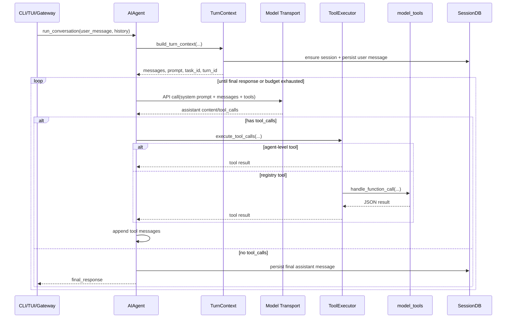

# Hermes 运行机制分析

> 代码阅读范围：`hermes_cli/main.py`、`cli.py`、`run_agent.py`、`agent/agent_init.py`、`agent/turn_context.py`、`agent/conversation_loop.py`、`agent/tool_executor.py`、`model_tools.py`、`toolsets.py`、`agent/system_prompt.py`、`agent/conversation_compression.py`、`hermes_state.py`。

## 1. 总体心智模型

Hermes 可以理解成一个“多前端 + 单 Agent 核心 + 多工具后端”的运行时：

```text
CLI / TUI / Gateway / Desktop / API
        ↓
会话壳层：输入、命令、回调、SessionDB、UI 状态
        ↓
AIAgent：模型路由、system prompt、消息循环、工具调用、压缩、持久化
        ↓
Transport：chat_completions / codex_responses / anthropic_messages / bedrock_converse / codex_app_server
        ↓
模型返回 assistant message 或 tool_calls
        ↓
ToolExecutor + model_tools + tools.registry
        ↓
工具结果回填 messages，继续下一轮 API call，直到 final response
```

核心类仍然叫 `AIAgent`，但现在 `run_agent.py` 里的很多方法已经变成 thin forwarder。真正实现分散在 `agent/*`：

- `agent/agent_init.py`：初始化 agent。
- `agent/system_prompt.py`：组装 system prompt。
- `agent/turn_context.py`：每个 user turn 的前置准备。
- `agent/conversation_loop.py`：主对话循环。
- `agent/tool_executor.py`：执行模型请求的工具调用。
- `agent/conversation_compression.py`：上下文压缩与 session 轮转。
- `agent/chat_completion_helpers.py`：实际 API 调用、流式处理、fallback、错误重试。

## 2. 启动入口

主要命令入口在 `hermes_cli/main.py`。

### 2.1 `cmd_chat`

`cmd_chat(args)` 是 chat 模式入口，负责：

1. 判断是否启用 TUI：
   - `--cli` 强制 classic CLI。
   - `--tui` 或 `HERMES_TUI=1` 强制 TUI。
   - 否则读 `display.interface`。
2. 处理 `--continue` / `--resume`：
   - `--continue` 无参数时解析最近 session。
   - `--continue "name"` 或 `--resume "name"` 会尝试按标题或 session id 解析。
3. 检查是否已配置 provider。
4. 启动后台 update check。
5. 同步 bundled skills。
6. 处理启动开关：
   - `--yolo` → `HERMES_YOLO_MODE=1`
   - `--ignore-user-config` → 忽略用户配置
   - `--ignore-rules` → 跳过 context files 和 memory
   - `--source` → 标记 session source
7. 如果是 TUI，调用 `_launch_tui(...)`。
8. 否则导入 classic `cli.py` 并进入 `HermesCLI`。

### 2.2 Classic CLI

Classic CLI 的主体是 `cli.py` 中的 `HermesCLI`。

它负责的是“交互壳”而不是核心推理：

- prompt_toolkit 输入循环。
- Rich/banner/status/spinner 展示。
- slash command 分发。
- 图片附件、语音、确认弹窗、sudo/secret/clarify UI。
- SessionDB 初始化和 resume/history 管理。
- 懒初始化 `AIAgent`。
- 每次用户输入后调用 `agent.run_conversation(...)`。

`HermesCLI.__init__` 会先创建 session id 和 `SessionDB`，但 `AIAgent` 通常在第一次真正对话时才初始化。

### 2.3 TUI / Gateway / Desktop

Hermes 有多个前端，但核心模式相同：

- TUI：Ink/Node 前端通过 stdio JSON-RPC 调 `tui_gateway`，Python 侧创建/复用 `AIAgent`。
- Gateway：`gateway/run.py` 管理平台消息、agent cache、超时、session key，然后调用 `AIAgent`。
- Desktop：Electron/React 通过 `tui_gateway` 的 JSON-RPC 后端走自己的会话/命令管线。

差异主要在 UI、回调和 session scoping；模型调用和工具循环还是 `AIAgent` 这套。

## 3. AIAgent 初始化逻辑

`run_agent.py` 中的 `AIAgent.__init__` 基本只转发到：

```python
from agent.agent_init import init_agent
init_agent(self, ...)
```

初始化做的事很多，关键分组如下。

### 3.1 基础运行状态

`init_agent()` 会设置：

- `model`、`provider`、`base_url`、`api_key`
- `max_iterations`
- `iteration_budget`
- `quiet_mode` / callbacks
- `platform`、gateway 用户/聊天/thread 信息
- `session_id`
- `tool_progress_callback`、`stream_delta_callback`、`clarify_callback` 等前端回调
- interrupt 状态
- `/steer` 状态
- 当前 task id、turn id、API request id 等运行时字段

`iteration_budget` 值得注意：它不仅限制父 agent 的 API 调用，也会被 subagent 共享，避免 delegation 无限消耗。

### 3.2 API mode / Transport 选择

Hermes 不只支持 OpenAI-compatible Chat Completions。`init_agent()` 会根据 provider、base_url、model 自动确定 `api_mode`：

- `chat_completions`：默认 OpenAI-compatible 路径。
- `codex_responses`：OpenAI Responses / Codex / xAI 等。
- `anthropic_messages`：Anthropic Messages API，以及 Anthropic-compatible 端点。
- `bedrock_converse`：AWS Bedrock Converse。
- `codex_app_server`：把 turn 交给 Codex app-server subprocess。

后续主循环通过 `agent._get_transport()` 获取 transport，并用统一的 `normalize_response()` 把不同 provider 的响应规整成 Hermes 内部的 assistant message。

### 3.3 OpenAI client / HTTP 连接管理

即使很多 provider 不是 OpenAI，OpenAI Python SDK 仍是 OpenAI-compatible 路径的主要客户端。Hermes 做了几层连接管理：

- 延迟导入 OpenAI SDK，降低 `run_agent.py` import 成本。
- 使用 keepalive httpx client。
- 检测 closed client。
- stale connection 清理。
- request-level client 与 primary shared client 分离。
- 流式连接卡死时强制关闭 socket 并重建连接池。

这是为了适配长生命周期 gateway、网络断流、SSE ping 空转、CLOSE-WAIT 积累等真实运行问题。

### 3.4 工具装配

初始化时会调用：

```python
model_tools.get_tool_definitions(enabled_toolsets, disabled_toolsets, quiet_mode=True)
```

得到 OpenAI function-calling 格式的 tool schema，并保存到：

- `agent.tools`
- `agent.valid_tool_names`

之后还会追加：

- 外部 memory provider 的工具。
- active context engine 的工具。

工具是否出现取决于 toolset、环境变量、check_fn、插件注册和配置。

### 3.5 内置状态组件

初始化还会创建/加载：

- `TodoStore`：agent-level todo 工具状态。
- `MemoryStore`：内置 `MEMORY.md` / `USER.md`。
- `MemoryManager`：外部 memory provider 编排。
- `CheckpointManager`：文件变更快照。
- `ContextCompressor` 或插件 context engine。
- fallback provider chain。
- skills nudge / memory nudge 计数器。

## 4. System Prompt 组装

实现文件：`agent/system_prompt.py`。

Hermes 把 system prompt 分成三层：

1. **stable**
   - agent identity
   - Hermes docs/skill 提示
   - 工具使用纪律
   - memory/session_search/skill guidance
   - skills index
   - 环境提示、平台提示
   - provider/model 特殊说明
2. **context**
   - 用户传入的 `system_message`
   - `AGENTS.md`、`HERMES.md`、`SOUL.md`、`.cursorrules` 等项目上下文
3. **volatile**
   - 内置 memory 快照
   - 外部 memory provider 的 system prompt block
   - conversation start date、session id、model、provider

`agent._cached_system_prompt` 会缓存组装结果。每个 session 通常只构建一次，只有 context compression 等场景才会 invalidate/rebuild。

设计目的：**保持 prompt prefix cache 稳定**。因此很多动态上下文不会直接改 system prompt，而是在每次 API call 时临时注入当前 user message。

## 5. 一次 User Turn 的前置准备

主入口是 `AIAgent.run_conversation(...)`，它转发到 `agent/conversation_loop.py::run_conversation()`。

进入主循环前，先调用：

```python
build_turn_context(...)
```

实现文件：`agent/turn_context.py`。

它做的是每轮只做一次的 prologue：

1. 安装 safe stdio，避免 broken pipe 把进程打崩。
2. 确保 `SessionDB` 中存在 session row。
3. 设置 auxiliary client 的主 provider/model。
4. 设置日志 session context。
5. 恢复主 runtime，清掉上一轮 fallback 状态。
6. 清理输入里的非法 surrogate。
7. 生成 `effective_task_id` 和 `turn_id`。
8. 重置本轮 retry counters。
9. 检查 stale connections。
10. 初始化/复制 conversation history。
11. 从 history hydrate todo 和 memory nudge counters。
12. 递增 user turn count。
13. 添加当前 user message 到 `messages`。
14. 如果 system prompt 尚未缓存，就构建。
15. 立即持久化当前 user message，增强崩溃恢复。
16. 做 preflight context compression。
17. 调用 `pre_llm_call` 插件 hook。
18. 调用外部 memory provider 的 `prefetch_all()`。

返回的 `TurnContext` 包含主循环需要的局部状态：

- `messages`
- `active_system_prompt`
- `effective_task_id`
- `turn_id`
- 当前 user message index
- 插件临时上下文
- external memory recall context

## 6. 主对话循环

核心循环在 `agent/conversation_loop.py`：

```python
while (api_call_count < agent.max_iterations and agent.iteration_budget.remaining > 0) or agent._budget_grace_call:
    调用模型
    归一化响应
    如果有 tool_calls：执行工具，把 tool result 加回 messages，continue
    如果没有 tool_calls：得到 final_response，break
```

实际实现比这个复杂很多，主要是为了处理模型/网络/provider 的各种失败模式。

### 6.1 每次 API call 前

主循环每次迭代会：

- 检查 interrupt。
- 消耗 iteration budget。
- 调用 `step_callback`，让 gateway/TUI 知道进入第几步。
- 处理 `/steer`。
- 将内部 `messages` 转成 provider 可接受的 `api_messages`。
- 在当前 user message 上临时注入：
  - external memory recall context
  - plugin `pre_llm_call` context
- 追加 cached system prompt。
- 追加 ephemeral system prompt。
- 追加 prefill messages。
- 构建 transport-specific `api_kwargs`。

注意：临时注入的 memory/plugin context 只进入 API 请求，不写回持久化消息。

### 6.2 API 调用与 normalize

API 调用逻辑集中在 `agent/chat_completion_helpers.py`：

- 非流式：`_interruptible_api_call`
- 流式：`_streaming_api_call`

不同 `api_mode` 走不同分支：

- `chat_completions`：`client.chat.completions.create(...)`
- `codex_responses`：Responses/Codex adapter
- `anthropic_messages`：Anthropic SDK messages API
- `bedrock_converse`：boto3 Bedrock Converse

返回后主循环调用：

```python
transport.normalize_response(response)
```

得到统一格式：

- `content`
- `tool_calls`
- `finish_reason`
- reasoning 相关字段

这让后续工具执行和 final response 判断不关心底层 provider 差异。

### 6.3 使用量、成本和上下文窗口

如果 response 有 usage：

1. 用 `normalize_usage(...)` 规整 token 字段。
2. 更新 `context_compressor` 的 prompt/completion/total token。
3. 累加 session token 和估算 cost。
4. 写入 `SessionDB.update_token_counts(...)`。
5. 如果探测到了模型 context length，写入缓存。

Hermes 做的是“每次 API call 都尽量写 token accounting”，这样 gateway、cron、delegation 等非 CLI 路径也不会漏统计。

### 6.4 工具调用路径

如果 assistant message 有 `tool_calls`：

1. 检查和修复 malformed / invalid JSON / truncated tool arguments。
2. 对 tool calls 做去重、限制 delegation 次数等 guardrail。
3. 把 assistant tool-call message 追加到 `messages`。
4. 调用：

```python
agent._execute_tool_calls(assistant_message, messages, effective_task_id, api_call_count)
```

`agent._execute_tool_calls` 会根据模型/配置决定并发或顺序执行。实际实现位于 `agent/tool_executor.py`。

工具结果以 role=`tool` 的消息追加到 `messages`，然后主循环 `continue`，让模型看到工具结果后继续推理。

### 6.5 Final response 路径

如果没有 tool calls：

- `assistant_message.content` 成为 `final_response`。
- 清理 think block / 空响应 scaffolding。
- 追加 assistant message。
- 持久化 session。
- 同步外部 memory provider。
- 返回：

```python
{
  "final_response": final_response,
  "messages": messages,
  "api_calls": api_call_count,
  "completed": True,
}
```

## 7. 工具系统

工具系统分两层：

1. **Schema 装配层**：`model_tools.get_tool_definitions()`
2. **执行分发层**：`agent/tool_executor.py` + `model_tools.handle_function_call()`

### 7.1 Toolset 到 schema

`toolsets.py` 定义工具组。核心列表是 `_HERMES_CORE_TOOLS`，包括：

- web
- terminal/process
- file
- skills
- browser
- tts
- todo/memory
- session_search
- clarify
- execute_code/delegate_task
- cronjob
- messaging
- kanban
- computer_use

`get_tool_definitions()` 的流程：

1. 根据 `enabled_toolsets` / `disabled_toolsets` 解析应该包含的工具名。
2. 调用 `tools.registry.get_definitions(...)` 获取可用工具 schema。
3. 运行每个工具的 `check_fn`，过滤不可用工具。
4. 动态改写部分 schema：
   - `execute_code` 只列出当前真正可用的 sandbox tools。
   - Discord schema 根据 bot intents 和配置动态收缩。
   - `browser_navigate` 在 web tools 不可用时去掉相关描述。
5. 做 schema sanitizer，提高对 llama.cpp 等严格后端的兼容性。
6. 如果 tool surface 太大，启用 `tool_search/tool_describe/tool_call` 渐进披露，把 MCP/plugin 工具藏到 bridge 后面。

结果会 memoize。缓存 key 包括 toolset、registry generation、config 文件指纹、kanban 环境等。

### 7.2 Agent-level 工具

有些工具不能只靠 registry handler 执行，因为它们需要 agent 当前状态：

- `todo`：需要当前 agent 的 `TodoStore`。
- `memory`：需要当前 agent 的 `MemoryStore`。
- `session_search`：需要当前 session DB。
- `delegate_task`：需要创建子 agent，并共享 budget/context。

这些工具在 `agent/tool_executor.py` 中被特判，不会直接进入 `model_tools.handle_function_call()`。

### 7.3 普通工具执行

普通工具进入：

```python
model_tools.handle_function_call(...)
```

该函数负责：

1. 按 schema 做参数类型 coercion。
2. 如果是 `tool_search` bridge，先解析成底层真实工具。
3. 应用 tool request middleware。
4. 调用 `pre_tool_call` plugin hook，允许阻断。
5. 从 registry 找 handler 并执行。
6. 清理错误文本中的结构化注入风险。
7. 调用 `post_tool_call` hook。
8. 返回 JSON string。

工具执行还会带上：

- `task_id`：隔离 terminal/browser/process 等资源。
- `session_id`
- `turn_id`
- `api_request_id`
- tool middleware trace
- enabled toolsets

## 8. 上下文压缩机制

上下文压缩由 `ContextCompressor` 和 `agent/conversation_compression.py` 协作。

触发时机：

1. turn prologue 的 preflight compression。
2. 工具执行后根据真实 provider usage 决策。
3. API 返回 context length / payload too large 错误时进行补救性压缩。
4. 用户手动 `/compress`。

压缩流程大致是：

1. 估算当前 messages + tools + system prompt 的 token。
2. 获取 compression lock，避免同一 session 并发压缩造成 fork。
3. 调用 memory provider 的 `on_pre_compress(messages)`。
4. 调用 `context_compressor.compress(...)` 生成 summary。
5. 把旧 session `end_session(reason="compression")`。
6. 生成新的 session id。
7. 创建新 session row，parent_session_id 指向旧 session。
8. 重新构建 system prompt。
9. 重置 DB flush cursor。
10. 通知 context engine 和 memory provider `on_session_switch(...)`。
11. 清理 file-read dedup cache。

压缩不是简单“删除旧消息”，而是一次 session boundary rollover。这样 SessionDB 可以保留 lineage。

## 9. Session 持久化

Hermes 持久化分两条路：

1. JSON session log：`_save_session_log(messages)`
2. SQLite：`SessionDB`

`AIAgent._persist_session(messages, conversation_history)` 会：

1. 删除尾部空响应恢复用 scaffolding。
2. 应用 `persist_user_message` override，防止 API-only synthetic prefix 写进历史。
3. 更新 `agent._session_messages`。
4. 写 JSON log。
5. 调用 `_flush_messages_to_session_db(...)`。

`_flush_messages_to_session_db` 使用 `_last_flushed_db_idx` 防止重复写入。写入字段包括：

- role
- content
- tool name
- tool calls
- tool call id
- finish reason
- assistant reasoning
- Codex reasoning/message items

多模态内容会被简化：

- tool result 中的 base64/image 不直接进 DB。
- 图片类内容用 `[screenshot]` 等文本摘要替代。

设计重点：**几乎所有错误路径、中断路径、截断路径都会调用 `_persist_session()`**。这比只在成功结束时写历史更稳。

## 10. 错误恢复与 fallback

Hermes 主循环大量代码在处理“不理想但常见”的模型/网络行为：

- invalid JSON tool arguments：最多重试，仍失败则注入 tool error 让模型自修复。
- truncated tool call：拒绝执行不完整参数，避免危险半截 JSON。
- empty response：插入 recovery prompt 或 thinking prefill。
- incomplete reasoning scratchpad：重试。
- streaming mid-tool-call drop：重试并清理连接池。
- stale stream：关闭 request client，重建 primary client。
- context length / 413：尝试压缩后重试。
- provider API error：分类、重试、fallback。
- billing / credits / content policy：生成更明确的用户响应。

Fallback provider 激活时会：

1. 切换 model/provider/base_url/api_mode。
2. 替换 client。
3. 重新计算 prompt caching 策略。
4. 更新 context compressor 的模型上下文长度。
5. 继续同一个 turn。

## 11. 中断和资源释放

Hermes 区分两个关闭层级：

- `release_clients()`：gateway cache eviction 时用。只释放 LLM client 和 per-turn child agents，不杀 terminal/browser/process/memory provider 等跨 turn 状态。
- `close()`：真正 session boundary / agent teardown。释放 task resources、browser、children、OpenAI/httpx client 等。

中断机制使用 agent 内部 flag 和 execution thread id：

- API call 前检查。
- retry wait 中检查。
- streaming 中可关闭 request client。
- tool loop 中断会停止继续调用模型。

## 12. 一次完整运行流程图



## 13. 关键设计取舍

### 13.1 AIAgent 是门面，agent/* 是实际模块

`run_agent.py` 仍然是很多测试和外部代码 patch 的入口，所以保留了大量 forwarder。这样能兼容旧接口，同时把 12k 行核心逻辑拆到可维护模块里。

### 13.2 System prompt 稳定优先

Hermes 明确追求 prefix cache 命中：

- system prompt 缓存到 agent 实例。
- memory 写入不立即刷新当前 prompt。
- 外部 memory recall 和 plugin context 注入 user message，而不是改 system prompt。
- timestamp 只到 date，不到 minute。

### 13.3 工具面动态收缩

工具不是“全都塞给模型”。Hermes 根据 toolset、check_fn、配置、上下文窗口动态组装 schema；工具太多时用 tool_search bridge 渐进披露。这对本地模型和小上下文模型尤其重要。

### 13.4 错误处理偏保守

遇到截断 tool call 或损坏 JSON，Hermes 倾向于拒绝执行或让模型重试，而不是猜测参数。这是安全边界的一部分。

### 13.5 Session 是可恢复运行单位

SessionDB 不只是聊天记录：

- 支持 resume。
- 支持 session_search。
- 支持 compression lineage。
- 存 token/cost/accounting。
- 支持 title、rewind、branch 等上层能力。

## 14. 一句话总结

Hermes 的运行机制是：前端把用户输入包装成 session turn，`AIAgent` 通过缓存 system prompt 和 `TurnContext` 构造请求，在统一 transport 上调用模型；模型若返回工具调用，则由 agent-level executor 和 registry dispatcher 执行并把结果回填消息，再继续调用模型；最终响应、token、工具轨迹和压缩 lineage 都被尽量持久化到 SessionDB/日志中，形成一个可恢复、可扩展、可多前端复用的 agent runtime。
